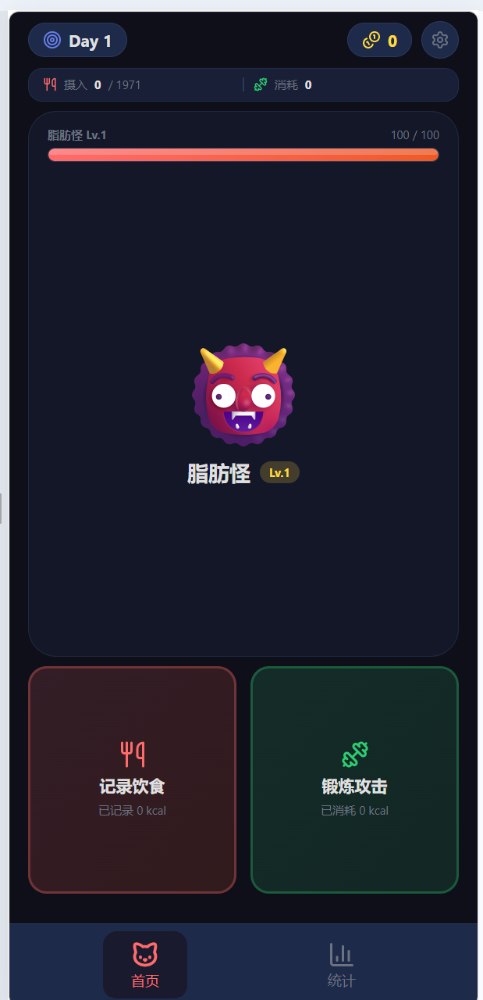
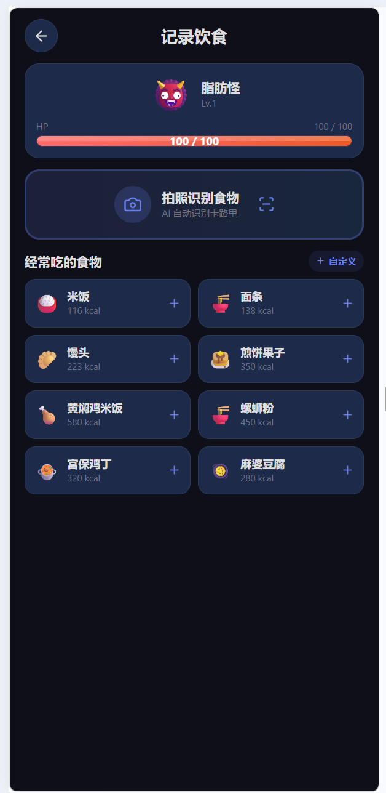
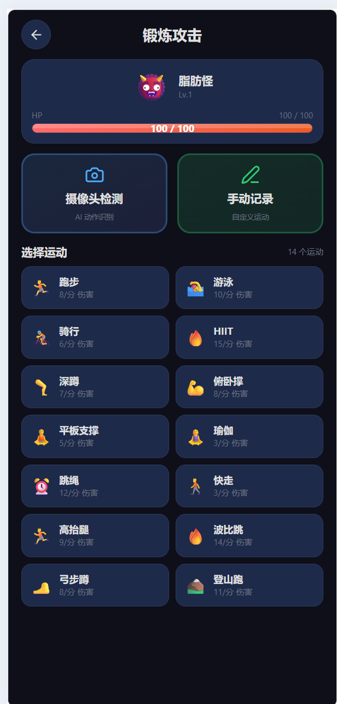
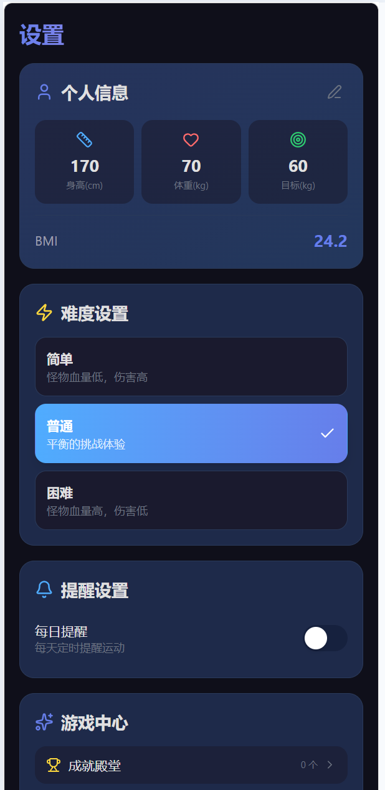

# 【生活娱乐】- 减肥大作战

---

## 1. Demo 简介

**是什么：** 一款游戏化减肥App的交互Demo，将减肥过程转化为RPG打怪冒险，通过控制饮食和锻炼来击败"脂肪怪"。

**面向谁：**
- 想减肥但缺乏动力的年轻上班族和大学生
- 尝试过传统减肥App但难以坚持的用户
- 喜欢游戏化体验、希望减肥过程更有趣的群体

**主要功能：**

| 功能 | 说明 |
|------|------|
| **角色创建** | 输入身高体重，自动计算BMI，选择角色形象，生成专属关卡 |
| **饮食记录** | 分早午晚+零食四餐记录，快捷食物一键添加，超标怪物回血 |
| **锻炼攻击** | 8种运动类型（跑步/游泳/HIIT等），选择时长对怪物发起强力攻击 |
| **怪物战斗** | 每日精英小怪，血条实时变化，击败获得金币奖励 |
| **战绩统计** | 减肥进度、击败怪物数、总伤害、本周概览 |

---

## 2. Demo 创作思路

**灵感来源：**
受Nintendo Switch《健身环大冒险》启发——将枯燥的健身变成有趣的RPG冒险。我发现身边很多人下载减肥App后3天就放弃，核心原因是"太无聊"。如果能让减肥像打游戏一样上瘾，坚持率会大幅提升。

**想解决的问题：**
1. **缺乏动力** —— 传统App只是记录工具，没有持续使用的动力
2. **枯燥乏味** —— 每天记录数据像完成任务，毫无乐趣
3. **反馈滞后** —— 体重变化慢，看不到即时成果容易放弃
4. **容易反弹** —— 达到目标后缺乏维护机制

**为什么做这个方向：**
- 中国超重/肥胖人群超50%，减肥健康市场超百亿
- 游戏化已被健身环证明有效，但在饮食控制领域几乎空白
- 差异化定位：不是"记录工具"，而是"冒险游戏"
- 锻炼是减少怪物血量最快的方式，巧妙引导用户多运动

---

## 3. Demo 体验地址

**在线体验：** https://roarpeng-trae-idera.ms.show

**本地体验方式：**
下载本帖附件中的 `减肥大作战_创意提案.html`，双击用浏览器打开即可完整体验。

**体验流程：**
1. 点击"开始冒险"进入角色设置
2. 输入身高、体重、目标体重，实时计算BMI
3. 选择角色形象，生成专属关卡
4. 在"饮食"页记录三餐，观察怪物血量变化
5. 在"锻炼"页选择运动类型和时长，对怪物发起攻击
6. 击败怪物后获得金币，进入下一天新挑战

---

## 4. TRAE 实践过程

**开发流程：**

1. **需求梳理** —— 用TRAE明确游戏化减肥的核心玩法：饮食记录=怪物回血，锻炼=攻击怪物
2. **架构设计** —— React + TypeScript + Vite 单页应用，包含欢迎页、设置页、战斗主页、饮食页、锻炼页、统计页
3. **交互实现** —— 完整的游戏状态管理、战斗系统、localStorage存档、即时反馈系统（XP飘字、连击奖励、升级弹窗）
4. **UI打磨** —— 暗色游戏风格，血条动画、伤害飘字、怪物抖动等战斗反馈，脂肪怪嘲讽系统
5. **部署上线** —— 通过ModelScope Studio部署为公开可访问的Web应用

**关键开发步骤：**

- Step 1: 搭建页面框架和底部导航切换
- Step 2: 实现角色设置和BMI计算
- Step 3: 实现怪物战斗系统和血条UI
- Step 4: 实现饮食记录（分餐+快捷食物）
- Step 5: 实现锻炼攻击系统（8种运动×6种时长）
- Step 6: 实现胜利/失败弹窗和天数推进
- Step 7: 实现统计页和localStorage存档
- Step 8: 实现即时反馈系统（XP飘字、连击、升级）
- Step 9: 实现脂肪怪嘲讽台词系统
- Step 10: 实现摄像头锻炼动作识别（MediaPipe Pose）
- Step 11: 部署到ModelScope Studio并优化加载性能（代码分割+gzip压缩）

**使用TRAE的关键对话Session：**

| Session ID | 时间 | 主要内容 |
|------------|------|---------|
| `6a329a2fae850a86c40e6181` | 2026-07-02 | 项目调研与核心功能开发：搭建游戏化减肥App整体架构，实现食物卡路里追踪、摄像头姿态检测、怪物战斗系统，完成BMI计算、每日/每周/每月怪物关卡设计 |
| `6a48b4d1d2d79e9f013bd132` | 2026-07-04 | 即时反馈系统与UI大改版：实现XP飘字、连击奖励、升级弹窗，新增成就殿堂/每日任务/技能系统三个页面，完成摄像头游戏化HUD设计（左侧能量条+右侧引导面板），实现人体离开摄像头自动暂停/恢复机制，修复页面宽度一致性问题 |
| `6a4ba271a37b46427d23422b` | 2026-07-06 | 部署上线与性能优化：通过ModelScope Studio完成公开部署，解决加载慢问题（代码分割recharts/framer-motion等重型库、server.js启用gzip压缩、修复Content-Length），设计并优化应用图标 |

**开发关键步骤截图：**

### 战斗主页 — 脂肪怪实时血条

首页展示每日脂肪怪，顶部显示摄入/消耗进度，中间为怪物血条与形象，底部为「记录饮食」和「锻炼攻击」两大核心入口。

---

### 饮食记录 — AI拍照识别 + 快捷添加

饮食页顶部显示缩小版脂肪怪血条，支持拍照AI识别食物卡路里，下方提供「经常吃的食物」快捷列表（米饭、面条、煎饼果子、螺蛳粉等接地气选项），一键添加。

---

### 锻炼攻击 — 14种运动任选

锻炼页提供「摄像头检测（AI动作识别）」和「手动记录」两种模式，支持14种运动类型（跑步、游泳、HIIT、深蹲、俯卧撑等），每种运动标注每分钟伤害值。

---

### 设置页面 — 个人信息与难度调节

设置页展示个人信息（身高/体重/目标/BMI），支持三档难度切换（简单/普通/困难），并可进入游戏中心查看成就殿堂。

---

## 附件

- `减肥大作战_创意提案.html` —— 完整交互Demo（请下载后用浏览器打开体验）

---

**社区报名帖链接：** （请在此处附上你通过初赛的社区报名帖链接）
